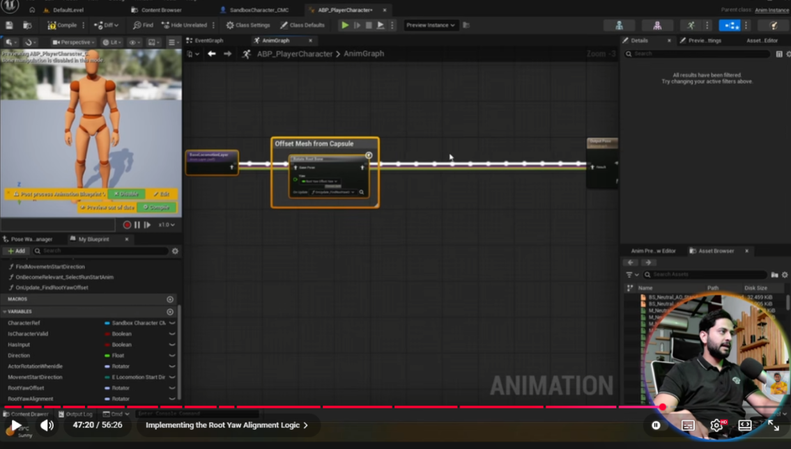

# Game Animation Sample Project (GASP)

This repository contains learning materials and project experiments based on the Unreal Engine Game Animation Sample Project.

## Learning Progress

Currently studying the tutorial series: 
[Unreal Engine Game Animation Sample / Motion Matching](https://www.youtube.com/watch?v=aqwBuL9ZjIs)

**Topic:** UE5 | Technical Animation In Video Games | Beginners Course | Part-1  
**Current Focus:** Implementing the Root Yaw Alignment Logic (AnimGraph)

*(Note: Please manually save the screenshot as `Learning_Screenshot.png` in the root directory to display it here.)*

## Setup Notes
- Temporary directories (`DerivedDataCache`, `Intermediate`, `Saved`) are ignored.
- Files strictly exceeding 8MB are excluded via `.gitignore` to maintain repository size limits without LFS.
